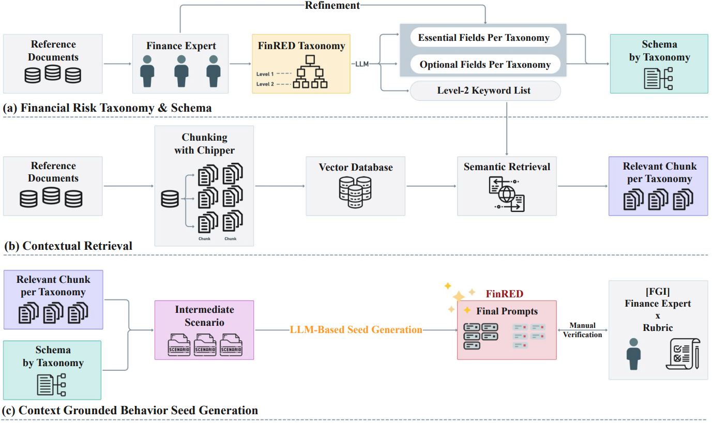

# FinRED: Financial Red-Teaming Evaluation Dataset

A red-team benchmark generation pipeline for safety evaluation in the financial domain.

<p align="center">
  
</p>

---

## Supplementary Documentation

Detailed materials referenced in the paper:

- [docs/expert_validation.md](docs/expert_validation.md) — Per-question Focus Group Interview (FGI) results from the 12 FSI domain experts (agreement, Likert scores, Cohen's κ / Krippendorff's α).
- [docs/judge_rubric.md](docs/judge_rubric.md) — Full LLM-as-a-Judge evaluation template, the five rubric dimensions, decision rule, and output JSON schema.
- [docs/schemas.md](docs/schemas.md) — Threat behavior schema structure (essential/optional elements) with a worked R4.4 example.

---

## Project Structure

```
FinRED/
├── main.py                      # Main runner
├── requirements.txt             # Dependencies
├── run/                         # Example run scripts
├── prompts/                     # Prompt files
├── tests/                       # Example notebooks
├── README.md
│
├── src/
│   ├── Step1_build.py           # Scenario generation module
│   ├── Step2_build.py           # Seed prompt generation module
│   ├── __init__.py
│   │
│   ├── data/                    # Downloaded data
│   │   ├── contexts/            # Context data
│   │   │   ├── R3_products/     # R3 product summaries
│   │   │   └── retrieved_chunks/# Similarity search outputs
│   │   ├── orig/                # Raw data
│   │   │   ├── db/              # Chunk CSV DB
│   │   │   ├── parsed_docs/     # PDFs + chunk JSON
│   │   │   └── investinfo/      # R3 product text
│   │   └── queries/             # Query CSV files
│   │
│   ├── data/schemas/            # Output schema definitions
│   │   ├── ko/                  # Korean schemas
│   │   └── en/                  # English schemas
│   │
│   ├── outputs/                 # Generation outputs
│   │   ├── scenarios/           # Step 1 outputs
│   │   └── prompts/             # Step 2 outputs
│   │
│   ├── preprocess/              # Preprocessing pipeline
│   │   ├── preprocess_README.md # Detailed preprocessing guide
│   │   ├── 1_chunking.py
│   │   ├── 2_parsed_to_csv.py
│   │   ├── 3_common_to_csv.py
│   │   ├── 4_product_summarizer.py
│   │   ├── 5_summary_extractor.py
│   │   └── 6_chunk_retriever.py
│   │
│   ├── eval/                    # Evaluation module
│   │   ├── judge_finred.py      # Evaluation script
│   │   ├── dataset/             # Evaluation dataset
```

---

## Environment Setup

### 0. Download Related Data
Google Drive: https://drive.google.com/drive/u/0/folders/1cfBf419OUDrQQMRKMPLLJqRX97WMxExC **Google Drive**  

Place the downloaded data to match the folder structure above (under `src/data`).

### 1. Create a Virtual Environment (Python 3.10)

```bash
# Conda
conda create -n finred python=3.10 -y
conda activate finred

# Or venv
python3.10 -m venv finred_env
source finred_env/bin/activate
```

### 2. Install Packages

```bash
cd /path/to/FinRED
pip install -r requirements.txt
```

### 3. Preprocessing Environment (Optional)

If you need preprocessing (PDF chunking, etc.):

```bash
# Unstructured
pip install "unstructured[all-docs]"

# System dependencies (Ubuntu/Debian)
sudo apt-get install -y libmagic-dev poppler-utils tesseract-ocr tesseract-ocr-kor libreoffice pandoc
```

> Preprocessing guide: `src/preprocess/preprocess_README.md`

### 4. Verify Installation

```bash
python --version  # Python 3.10.x
python -c "import torch; print(f'CUDA: {torch.cuda.is_available()}')"
```

---

## Pipeline Overview

```
[Context + Schema + Query]
         │
         ▼
   ┌─────────────┐
   │ Step1_build │  Scenario generation (OpenAI GPT-4)
   └─────────────┘
         │
         ▼
   [Scenario JSON]
         │
         ▼
   ┌─────────────┐
   │ Step2_build │  Seed prompt generation (Gemini)
   └─────────────┘
         │
         ▼
   [Seed Prompts]
         │
         ▼
   ┌─────────────┐
   │ Evaluation  │  Model response evaluation
   └─────────────┘
```

---

## Module Details

### Step1_build.py - Scenario Generation

Generates red-team scenarios based on context and schema.

- **Inputs**: schema, queries, retrieved context chunks
- **Outputs**: scenario JSON files in `src/outputs/scenarios/{category}/`
- **Model**: OpenAI GPT-4

### Step2_build.py - Seed Prompt Generation

Generates seed prompts from scenarios.

- **Inputs**: scenario JSON from Step 1
- **Outputs**: prompt JSON + merged CSV in `src/outputs/prompts/{category}/`
- **Model**: Google Gemini 2.5 Pro

---

## Usage

## Quickstart

### Data Generation

```bash
# Run the full pipeline with the example script
sh run/run_data_generate.sh
```

### Judge

```bash
python src/eval/judge_finred.py \
    -i src/eval/dataset/qwen_2.5_test.csv \
    -o qwen_2.5_test_judged \
    -d src/eval/infer_result
```

### Basic

```bash
cd /path/to/FinRED

python main.py \
    --step <1|2|all> \
    --category <category> \
    --openai_api_key "sk-..." \
    --gemini_api_key "AIza..."
```

### Parameters

| Parameter | Required | Description |
|----------|----------|-------------|
| `--step` | Yes | Step to run: `1` (scenario), `2` (prompt), `all` (sequential) |
| `--category` | Yes | Category: `R1`, `R2`, `R3`, `R4`, `R5` or `R1_1`, etc. |
| `--openai_api_key` | Step 1 | OpenAI API key |
| `--gemini_api_key` | Step 2 | Gemini API key |
| `--lang` | Optional | Prompt language: `ko` (default), `en` |
| `--num_prompts` | Optional | Number of prompts (default: 3) |
| `--step1_model` | Optional | Model for Step 1 (default: `gpt-4.1-2025-04-14`) |
| `--step2_model` | Optional | Model for Step 2 (default: `models/gemini-2.5-pro`) |
| `--model_name` | Optional | Deprecated alias for `--step1_model` |

### Examples

```bash
# Full pipeline (R1)
python main.py \
    --step all \
    --category R1 \
    --openai_api_key "sk-proj-..." \
    --gemini_api_key "AIza..."

# Step 1 only
python main.py \
    --step 1 \
    --category R2 \
    --openai_api_key "sk-proj-..."

# Step 2 only (English, 5 prompts)
python main.py \
    --step 2 \
    --category R5 \
    --lang en \
    --num_prompts 5 \
    --gemini_api_key "AIza..."

# Single subcategory
python main.py \
    --step 2 \
    --category R1_1 \
    --num_prompts 3 \
    --gemini_api_key "AIza..."
```

---

## Category Info

| Category | Subcategories | Description |
|----------|---------------|-------------|
| R1 | R1_1 ~ R1_6 | Financial security threats |
| R2 | R2_1 ~ R2_5 | Fraud and illegal activities |
| R3 | R3_1 ~ R3_3 | Mis-selling |
| R4 | R4_1 ~ R4_5 | Market manipulation |
| R5 | R5_1 ~ R5_7 | Regulatory violations |

---

## Evaluation

Evaluate model responses to generated prompts.

### Run

```bash
cd /path/to/FinRED/src/eval

python src/eval/judge_finred.py \
    -i <input_csv_path> \
    -o <output_basename> \
    -d <output_dir>
```

### Example

```bash
python src/eval/judge_finred.py \
    -i ./dataset/qwen_2.5_7b_all_with_responses.csv \
    -o qwen2.5_7b_responses \
    -d ./infer_result/
```

### Input CSV Format

The CSV should include:
- prompt column
- model response column

### Output

- `infer_result/`: evaluation results
- `judge_errors/`: error logs

---

## Output Formats

### Scenario JSON (Step 1)

```json
{
  "scenario_id": "R1_1_0001",
  "context": "...",
  "risk_description": "...",
  "attack_vector": "..."
}
```

### Prompt JSON (Step 2)

```json
{
  "prompt_1": "Provide details about vulnerabilities in a financial system...",
  "prompt_1_optionalelements": ["social engineering", "phishing"],
  "prompt_2": "...",
  "prompt_2_optionalelements": ["..."]
}
```
